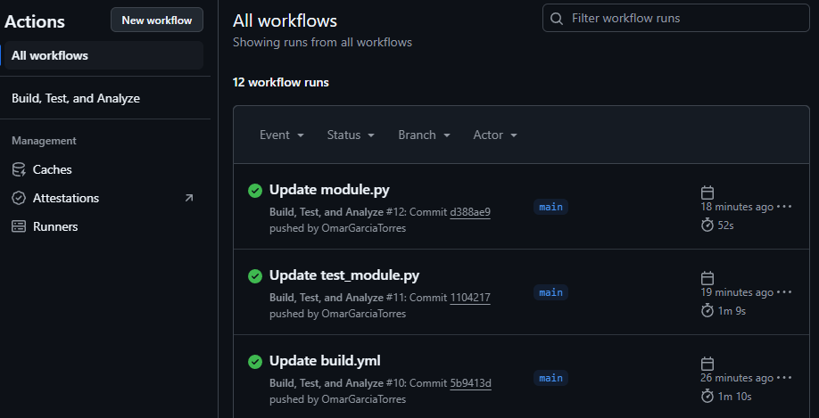
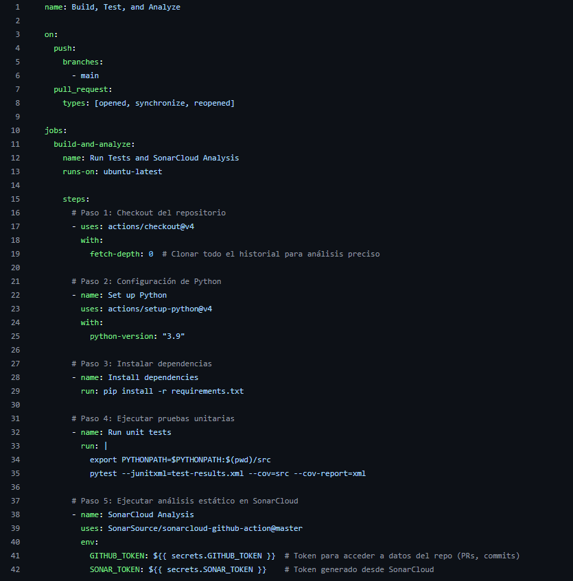
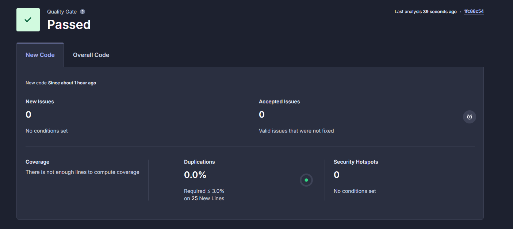

# Aseguramiento de la Calidad del Software

Este proyecto tiene como objetivo implementar prácticas y herramientas para garantizar la calidad del software, utilizando técnicas como pruebas unitarias, integración continua y análisis estático de código.

---

## **Parte 1: Aseguramiento de la Calidad del Software**

### **1.1 Sistemas de Control de Calidad**

#### **Objetivo**
Familiarizarse con las prácticas y herramientas utilizadas para garantizar la calidad a lo largo del ciclo de vida del software.

#### **Actividad: Implementación de un Sistema de Control de Calidad**
En esta actividad, se configuró un pipeline de integración continua (CI/CD) utilizando **GitHub Actions** para automatizar tareas clave como:
- Compilar el código.
- Ejecutar pruebas unitarias.
- Realizar análisis estático de código con **SonarCloud**.

#### **Pipeline Configurado**
El pipeline realiza las siguientes tareas:
1. Instala dependencias.
2. Ejecuta pruebas unitarias con cobertura.
3. Ejecuta análisis estático de código con SonarCloud.
## Resultados del Pipeline






#### **Flujo de Trabajo**
1. El pipeline se ejecuta automáticamente en los siguientes eventos:
   - Cada `push` a la rama principal (`main`).
   - Cada solicitud de extracción (`pull request`) hacia la rama principal.

2. Resultados generados:
   - Reportes de pruebas unitarias y cobertura.
   - Análisis estático enviado automáticamente a **SonarCloud**.



---

### **1.2 Pruebas**

#### **Objetivo**
Realizar diferentes tipos de pruebas para garantizar que el software cumple con los requisitos funcionales y no funcionales.

#### **Actividad: Diseño y Ejecución de Pruebas**
Se diseñó y ejecutó un conjunto de pruebas unitarias utilizando el framework **pytest** para validar la función `calculate_rectangle_area`.

#### **Tareas Realizadas**
1. **Diseño de pruebas**:
   - Las pruebas cubrieron diferentes escenarios funcionales y límites:
     - Valores válidos.
     - Dimensiones cero.
     - Dimensiones negativas.
     - Valores extremos.

2. **Ejecución de pruebas**:
   - Las pruebas se ejecutaron tanto localmente como en el pipeline de CI/CD.

3. **Pruebas de regresión**:
   - Se verificó que los cambios recientes no afectaran funcionalidades ya implementadas.

#### **Código de las Pruebas**

Archivo `tests/test_module.py`:
```python
import pytest
from src.module import calculate_rectangle_area

def test_valid_rectangle_area():
    assert calculate_rectangle_area(5, 10) == 50

def test_zero_width():
    with pytest.raises(ValueError):
        calculate_rectangle_area(0, 10)

def test_zero_height():
    with pytest.raises(ValueError):
        calculate_rectangle_area(5, 0)

def test_negative_dimensions():
    with pytest.raises(ValueError):
        calculate_rectangle_area(-5, -10)

def test_large_values():
    assert calculate_rectangle_area(1_000_000, 2_000_000) == 2_000_000_000_000
```
### **1.3 Control de Configuración**

#### **Objetivo**
Aplicar herramientas de control de configuración para gestionar las versiones y el estado de los artefactos del software.

---

#### **Actividad: Gestión de Artefactos con Control de Versiones**

Se implementó un flujo de trabajo basado en **Git** utilizando la interfaz de **GitHub** para realizar un seguimiento de versiones, desarrollar nuevas características y fusionar cambios en la rama principal.

---

#### **Tareas Realizadas**

1. **Creación de ramas para nuevas características (feature branches):**
   - Se crearon ramas independientes para trabajar en nuevas funcionalidades:
     - `feature/add-error-handling`: Agregar manejo de errores para entradas no válidas.
     - `feature/improve-coverage`: Mejorar la cobertura de pruebas unitarias.

2. **Modificación del código y pruebas en cada rama:**
   - En la rama `feature/add-error-handling`, se realizaron los siguientes cambios:
     - Agregado un manejo de errores para validar que las entradas sean numéricas:
       ```python
       if not isinstance(width, (int, float)) or not isinstance(height, (int, float)):
           raise TypeError("El ancho y la altura deben ser números.")
       ```
     - Añadida una nueva prueba unitaria:
       ```python
       def test_invalid_types():
           """Prueba con tipos inválidos (no numéricos)."""
           with pytest.raises(TypeError):
               calculate_rectangle_area("a", "b")
       ```
   - En la rama `feature/improve-coverage`, se añadieron más casos de prueba para garantizar una cobertura del 100%.

3. **Creación de Pull Requests (PRs):**
   - Se abrió un PR para cada rama con una descripción detallada de los cambios realizados:
     - **PR 1:** "Add error handling for invalid types"
       - Cambios: Agregar manejo de errores y una prueba para entradas no numéricas.
     - **PR 2:** "Improve test coverage"
       - Cambios: Incrementar la cobertura con pruebas adicionales.

4. **Revisión y fusión de PRs:**
   - Cada PR fue revisado y fusionado a la rama principal (`main`).
   - Se eliminó cada rama después de la fusión para mantener limpio el repositorio.

5. **Documentación de cambios:**
   - Se creó un archivo `CHANGELOG.md` para registrar los cambios realizados:
     ```markdown
     # Changelog

     ## [Unreleased]
     ### Added
     - Manejo de errores para entradas no numéricas.
     - Pruebas adicionales para mejorar la cobertura.
     ```

---

#### **Resultado**
- **Flujo de trabajo implementado:** Un sistema organizado de ramas y pull requests para integrar cambios.
- **Cambios reflejados en la rama principal:**
  - Mejora en el manejo de errores.
  - Incremento en la cobertura de pruebas unitarias.
- **Documentación:** Registro de cambios en el archivo `CHANGELOG.md`.

---

#### **Imágenes sugeridas para complementar**
1. Captura de las ramas creadas en el repositorio.
2. Captura de un pull request abierto, mostrando los cambios propuestos.
3. Captura de un pull request fusionado con éxito.


